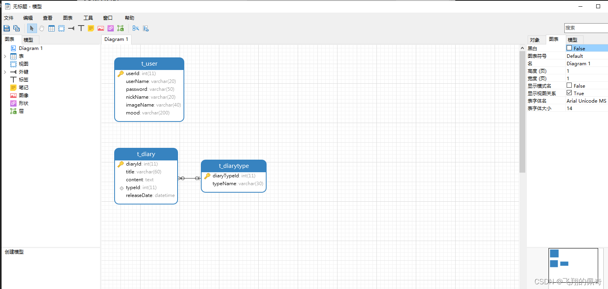

# 11024145-11024148-FinalReport
# 项目简介

本项目是一套基于 servlet 实现的日记本管理系统，主要针对计算机相关专业的正在做毕设的学生与需要项目实战练习的 Java 学习者。
包含：项目源码、数据库脚本等，该项目附带全部源码可作为毕设使用。
项目都经过严格调试，eclipse 确保可以运行！
该系统功能完善、界面美观、操作简单、功能齐全、管理便捷，具有很高的实际应用价值

# 技术实现

后端：servlet
前端采用：jsp，js，css
数据库：mysql5.0 及以上
运行环境及开发工具：jdk，idea 或者 eclipse，Navicat，tomcat

# 系统功能

主要功能有:
用户：日记查看，日记维护，日记类别维护，个人信息维护；
数据库要设计的表有:日记表，日记类别，用户表

# 系统结构图

# 论文文档截图

# 頁面截圖

# 數據庫

# 參考資料

https://blog.csdn.net/weixin_43860634/article/details/129281583
